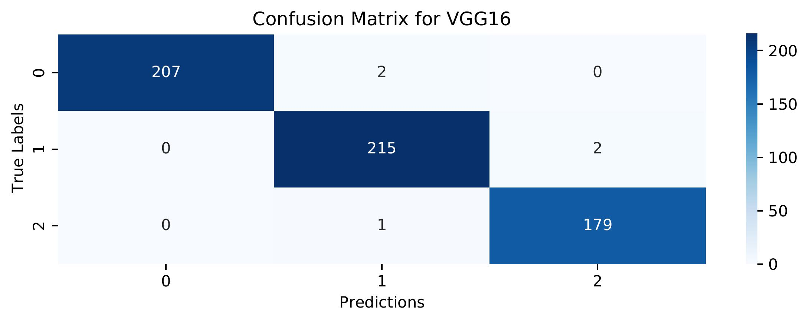
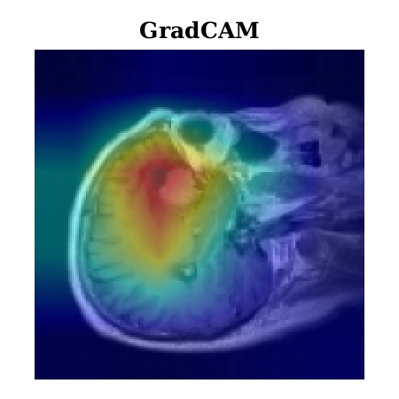
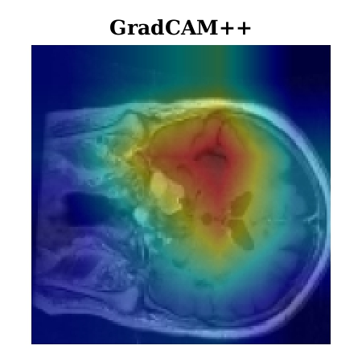

# Transfer Learning and Explainable AI for BrainTumor Classification: A Study Using MRI Data from Bangladesh

## Abstract
Brain tumors, regardless of being benign or malignant, pose considerable health risks, with malignant tumors being more perilous due to their swift and uncontrolled proliferation, resulting in malignancy. Timely identification is crucial for enhancing patient outcomes, particularly in nations such as Bangladesh, where healthcare infrastructure is constrained. Manual MRI analysis is arduous and susceptible to inaccuracies, rendering it inefficient for prompt diagnosis. This research sought to tackle these problems by creating an automated brain tumor classification system utilizing MRI data obtained from many hospitals in Bangladesh. Advanced deep learning models, including VGG16, VGG19, and ResNet50, were utilized to classify glioma, meningioma, and various brain cancers. Explainable AI (XAI) methodologies, such as Grad-CAM and Grad-CAM++, were employed to improve model interpretability by emphasizing the critical areas in MRI scans that influenced the categorization. VGG16 achieved the most accuracy, attaining 99.17\%. The integration of XAI enhanced the system's transparency and stability, rendering it more appropriate for clinical application in resource-limited environments such as Bangladesh. This study highlights the capability of deep learning models, in conjunction with explainable artificial intelligence (XAI), to enhance brain tumor detection and identification in areas with restricted access to advanced medical technologies.

## Table of Contents
- [Dataset](#dataset)
- [Methodology](#methodology)
- [Experimental Setups](#experimental-setups)
- [Results](#results)
- [Explainable AI](#explainable-ai)
- [Contact Information](#contact-information)
- [Citation](#citation)
- [License](#license)

## Dataset

The dataset used for training and evaluation is "Brain Cancer - MRI dataset" available on Mendeley Data. You can find the dataset <a href="https://data.mendeley.com/datasets/mk56jw9rns/1">here</a>.

## Methodology

## Experimental Setups
    
### Anaconda with VSCode
- **Environment:**
  - Python Version: 3.6.13 
  - Tensforflow Version: 2.6.2
  - Keras Version: 2.6.0
  - Processor: AMD Ryzen 5 3600 6 Core 12 Thread AM4 Processor
  - GPU: NVIDIA GeForce RTX 3060ti (8 GB)
  - RAM: 32 GB
  - Storage: 256 GB NVME SSD + 512 GB SATA SSD
    

## Results
### Performance Evaluation of Classification Models for Brain Cancer - MRI dataset

|  Disease   | Model Type         |    Model          | Accuracy | Precision | Recall | F1 Score |
|------------|--------------------|-------------------|----------|-----------|--------|----------|
|  Glioma    | Transfer Learning  | VGG16             | 0.99     | 0.98      | 0.98   | 0.98     |
|            |                    | VGG19             | 1.00     | 0.99      | 0.99   | 0.99     |
|            |                    | DenseNet          | 0.98     | 0.97      | 0.97   | 0.98     |
|            |                    | InceptionResNetV2 | 0.95     | 0.94      | 0.94   | 0.94     |
|            |                    | MobileNetV2       | 0.96     | 0.96      | 0.95   | 0.96     |
|            |                    | Xception          | 0.99     | 0.99      | 0.99   | 0.99     |
|            |                    | ResNet50V2        | 0.95     | 0.94      | 0.94   | 0.96     |
|            |                    | InceptionV3       | 0.96     | 0.96      | 0.94   | 0.95     |
| Meningioma | Transfer Learning  | VGG16             | 0.98     | 0.98      | 0.98   | 0.98     |
|            |                    | VGG19             | 0.98     | 0.97      | 0.97   | 0.98     |
|            |                    | DenseNet          | 0.98     | 0.98      | 0.97   | 0.98     |
|            |                    | InceptionResNetV2 | 0.95     | 0.94      | 0.94   | 0.94     |
|            |                    | MobileNetV2       | 0.96     | 0.96      | 0.96   | 0.96     |
|            |                    | Xception          | 0.99     | 0.98      | 0.99   | 0.99     |
|            |                    | ResNet50V2        | 0.95     | 0.95      | 0.95   | 0.96     |
|            |                    | InceptionV3       | 0.96     | 0.94      | 0.94   | 0.95     |
|   Tumor    | Transfer Learning  | VGG16             | 0.98     | 0.98      | 0.98   | 0.98     |
|            |                    | VGG19             | 0.98     | 0.98      | 0.98   | 0.98     |
|            |                    | DenseNet          | 0.97     | 0.97      | 0.98   | 0.98     |
|            |                    | InceptionResNetV2 | 0.94     | 0.94      | 0.94   | 0.94     |
|            |                    | MobileNetV2       | 0.96     | 0.96      | 0.96   | 0.96     |
|            |                    | Xception          | 0.98     | 0.99      | 0.98   | 0.98     |
|            |                    | ResNet50V2        | 0.95     | 0.94      | 0.94   | 0.95     |
|            |                    | InceptionV3       | 0.95     | 0.95      | 0.94   | 0.96     | 

## Explainable AI
- **Gradcam:**

- **Gradcam++:**

## Contact Information

For any questions or further inquiries, please feel free to reach out:

- **Shuvashis Sarkar**
  - Email: [shuvashisofficial@gmail.com](mailto:shuvashisofficial@gmail.com)
    
## Citation

If you find the research work helpful, please consider citing our paper:

## License
[MIT License](LICENSE)
